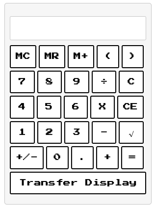
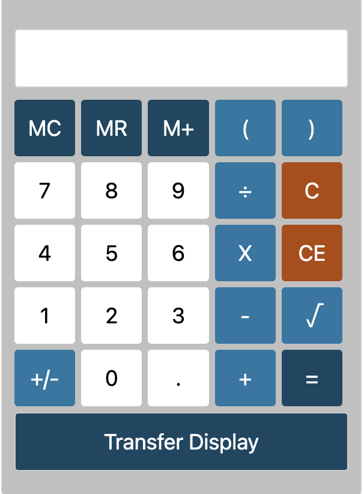

# GRECalculator

Welcome to the GRECalculator project!

## Description

The GRECalculator is a simple calculator application designed to help users
prepare for the GRE (Graduate Record Examination) test. It provides basic
arithmetic operations and additional features tailored to the needs of GRE test takers.

## Demo

    
    

## Features

- Addition, subtraction, multiplication, and division operations
- Memory functionality to store and recall values
- Customizable settings for user preferences (themes)

## Roadmap
- [x] Calculator MVP
- [ ] Timer
- [ ] Link GRE Resources

## Contributing

We welcome contributions from the community to enhance the GRECalculator project. If you would like to contribute, please follow these guidelines:

1. Fork the repository and create a new branch for your changes.
2. Make your changes and ensure that the code is well-tested.
3. Submit a pull request with a detailed description of your changes.

## Developer Notes

- Anyone is welcome to send changes to this codebase by following the contribution guidelines mentioned above.
- Feel free to open an issue if you encounter any bugs or have suggestions for improvements.
